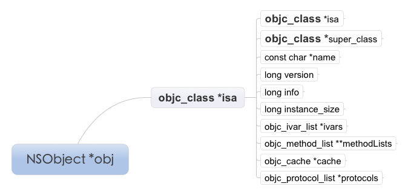

---

title:Objective-C Runtime基础知识

---

本文主要梳理Objective-C的Runtime相关的结构      

##相关的类/结构体
### NSObject

	@interface NSObject <NSObject> {
    	Class isa  OBJC_ISA_AVAILABILITY;
	}   
	
	
### Class   

	typedef struct objc_class *Class;
	
也就是说Class 等价于 objc_class*

### objc_class

	struct objc_class {
    	Class isa  OBJC_ISA_AVAILABILITY;
	#if !__OBJC2__
    	Class super_class                                        OBJC2_UNAVAILABLE;
    	const char *name                                         OBJC2_UNAVAILABLE;
    	long version                                             OBJC2_UNAVAILABLE;
    	long info                                                OBJC2_UNAVAILABLE;
    	long instance_size                                       OBJC2_UNAVAILABLE;
    	struct objc_ivar_list *ivars                             OBJC2_UNAVAILABLE;
    	struct objc_method_list **methodLists                    OBJC2_UNAVAILABLE;
    	struct objc_cache *cache                                 OBJC2_UNAVAILABLE;
    	struct objc_protocol_list *protocols                     OBJC2_UNAVAILABLE;
	#endif

	} OBJC2_UNAVAILABLE;
	
###objc_ivar_list
	struct objc_ivar_list {
    	int ivar_count                                           OBJC2_UNAVAILABLE;
	#ifdef __LP64__
    	int space                                                OBJC2_UNAVAILABLE;
	#endif
    	/* variable length structure */
    	struct objc_ivar ivar_list[1]                            OBJC2_UNAVAILABLE;
	}                                                            OBJC2_UNAVAILABLE;
###objc_method_list
	
	struct objc_method_list {
    	struct objc_method_list *obsolete                        OBJC2_UNAVAILABLE;
    	int method_count                                         OBJC2_UNAVAILABLE;
	#ifdef __LP64__
    	int space                                                OBJC2_UNAVAILABLE;
	#endif
    	/* variable length structure */
    	struct objc_method method_list[1]                        OBJC2_UNAVAILABLE;
	}
		                                                         OBJC2_UNAVAILABLE;
		                                                         
###objc_cache
	struct objc_cache {
    	unsigned int mask /* total = mask + 1 */                 OBJC2_UNAVAILABLE;
    	unsigned int occupied                                    OBJC2_UNAVAILABLE;
    	Method buckets[1]                                        OBJC2_UNAVAILABLE;
	};

###objc_protocol_list
	struct objc_protocol_list {
    	struct objc_protocol_list *next;
    	long count;
    	Protocol *list[1];
	};
### 总结
	
   好了，现在可以知道一个Objective-C的对象的基本结构是啥样子了，我再来画张属性图展示一下。
   
   
下面我来介绍一下Class这个类结构的各个变量的意义：   
isa 指向MetaClass对象地址，（MetaClass其实是该类的类对象，Objective-C的类也属于对象，就是MetaClass对象）
super_class 指向父类的MetaClass对象
name 类名   
version   
info   
instance_size   
ivars   
methodLists   
cache   
protocols   

